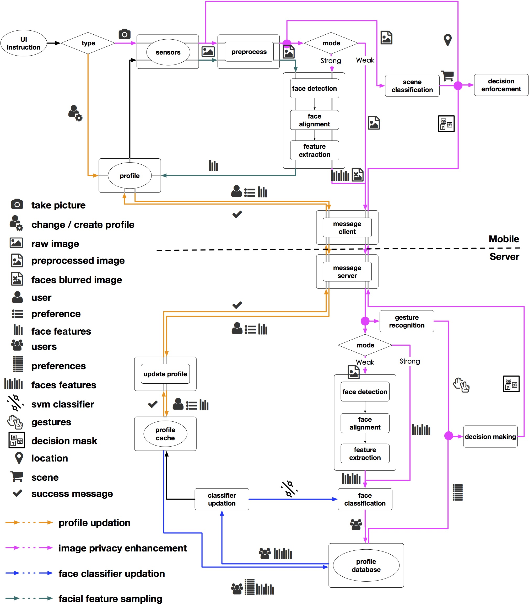

Cardea is a system in which user can set his/her privacy preference based on context, which includes location, surrounding scene and persons. When captured by an android camera, user's privacy preference will be enforced if context is matched. Interactive hand gestures can be used by user to overwrite his/her privacy setting temporarily.

Check [demo video](https://drive.google.com/file/d/0B4z8qjK8O_uUc0o2RjZWYktiMTg/view) for the usage of the system.

Dataflow

